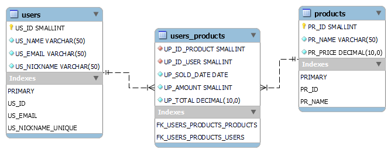

# Tim Corey Back-End Challenge

Esse projeto foi a realização de um desafio proposto por 
[IAmTimCorey](https://www.youtube.com/watch?v=BbxjvV3d9pY&t=177s&ab_channel=IAmTimCorey)

## Descrição do Desafio
Crie um sistema para capturar dados de compra de um chamador.
 
armazenar os dados em um banco de dados.

Se houver um usuário duplicado, atualize seus dados em vez de adicionar um novo registro.

## Modelo C4


## Diagrama do Banco de Dados



## Funcionalidades

- Cadastro de Conta.
- Visualização de Produtos.
- Compra de Produtos.
- Visualização de produtos comprados por usuário.


## Documentação da API

### Registrar um Novo Usuário
```http
  POST /api/users/register
```

| Parâmetro   | Tipo       | Descrição                           |
| :---------- | :--------- | :---------------------------------- |
| `name` | `string` |  Nome do usuário |
| `email` | `string` |  Email do usuário |
| `nickname` | `string` |  Apelido do usuário |

```
Response - 200
{
  "message": "conta criada com sucesso"
}
```

```
Response - 400
{
  "message": "usuário já existente"
}
```

```
Response - 400
{
  "message": "nome deve conter no mínimo 3 dígitos."
}
```

```
Response - 400
{
  "message": "email deve conter '@' e no mínimo 3 dígitos."
}
```

```
Response - 400
{
  "message": "nickname deve conter no mínimo 3 dígitos."
}
```

### Visualizar Informações do Usuário
```http
  POST /api/users/view
```

| Parâmetro   | Tipo       | Descrição                           |
| :---------- | :--------- | :---------------------------------- |
| `email` | `string` |  Email do usuário |
| `nickname` | `string` |  Apelido do usuário |

```
Response - 200
{
  "message": "usuário não encontrado"
}
```

```
Response - 200
{
  "name": "EXAMPLE",
  "email": "EXAMPLE@TEST.COM",
  "nickname": "EXAMPLE_NICKNAME"
}
```

### Visualizar Produtos Comprados do Usuário
```http
  POST /api/products/viewUserProducts
```

| Parâmetro   | Tipo       | Descrição                           |
| :---------- | :--------- | :---------------------------------- |
| `email` | `string` |  Email do usuário |

```
Response - 200
{
  "success": true,
  "message": "Nenhum produto encontrado",
  "data": null
}

```

```
Response - 200
{
  "success": true,
  "message": "produtos encontrados",
  "data": [
    {
      "pR_NAME": "Escova de Dentes",
      "pR_PRICE": 1,
      "uP_SOLD_DATE": "2023-09-22T00:00:00",
      "uP_AMOUNT": 50,
      "uP_TOTAL": 50
    },
    {
      "pR_NAME": "Cenouras (kg)",
      "pR_PRICE": 2,
      "uP_SOLD_DATE": "2023-09-22T00:00:00",
      "uP_AMOUNT": 50,
      "uP_TOTAL": 100
    }
  ]
}

```
### Comprar Produto
```http
  POST /api/products/buy
```

| Parâmetro   | Tipo       | Descrição                           |
| :---------- | :--------- | :---------------------------------- |
| `IdProduct` | `int` |  ID do produto |
| `email` | `string` |  Email do usuário |
| `amount` | `int` |  quantidade desejada do produto |

```
Response - 200
{
  "success": true,
  "message": "produto comprado",
  "data": null
}
```

```
Response - 400
{
  "success": false,
  "message": "usuário não encontrado",
  "data": null
}
```

```
Response - 400
{
  "success": false,
  "message": "produto não encontrado",
  "data": null
}
```

```
Response - 400
{
  "success": false,
  "message": "quantidade inválida",
  "data": null
}
```

#### Retorna todos os produtos

```http
  GET /api/products/viewProducts
```

| Parâmetro   | Tipo       | Descrição                           |
| :---------- | :--------- | :---------------------------------- |
| `N/A` | `N/A` |  Retorna todos os produtos registrados |

```
Response - 200
{
  "success": true,
  "message": "buscado todos os produtos",
  "data": [
    {
      "id": 1,
      "name": "Arroz",
      "price": 4
    },
    {
      "id": 2,
      "name": "Feijão",
      "price": 2
    },
    .....
  ]
}
```
## Stack utilizada

**Front-end:** Swagger.

**Back-end:** .NET 7, Dapper.


## Rodando localmente

 **AVISOS**
 
 * Garanta que há o VisualStudio 2022, MySQL e MySQL Workbench instalados.
 * Efetua as etapas no banco de dados para que funcione corretamente.

Clone o projeto

```bash
  git clone https://github.com/VictorSantos09/TimCorey-BackEnd-Challenge.git
```

### Configurando o Banco de Dados

Abra ChallegeDatabaseMER

Vá em Database > Forward Engineer > Selecione 'Next' (próximo) até completar.

Abra INSERTs.txt e execute o script no banco de dados. 

### Executando o programa

Entre no diretório do projeto

```bash
  cd TimCorey-BackEnd-Challenge
```

Inicie a solução

```bash
  start ChallengeCore.sln
```

Defina ChallengeUI como projeto de inicialização.

Execute o programa.
